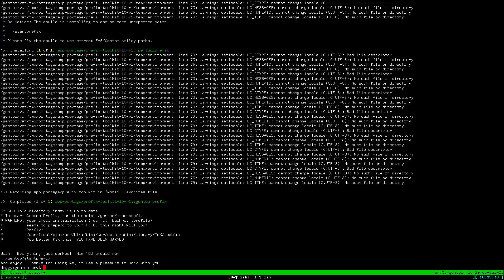

macOS 提供了较为标准的 POSIX 环境，但属于 BSD 流派，与 GNU 有微妙不好查觉的偏差，而且没有内置包管理器。因此我们一般会使用第三方的包管理器，推荐程度从高到低：

- Gentoo Prefix
- Homebrew
- Nix
- MacPorts

## Gentoo Prefix
[Gentoo Prefix](https://wiki.gentoo.org/wiki/Project:Prefix) 是当前由续本达领导开发的用户态基于 Gentoo Linux 的通用 GNU 环境。它的安装需要编译 Python 和 Portage （Gentoo 的包管理器）和 GCC，需要的时间较长，因此请保证计算机的供电。

如果从前没有在 macOS 上编译过程序，则需要安装苹果的 XCode 编译器。
```shell
xcode-select --install
xcode-select -switch /Library/Developer/CommandLineTools
```

接下来到[General Boostrap Process](https://wiki.gentoo.org/wiki/Project:Prefix/Bootstrap) 页面的 "Bootstrapping Prefix" 一节，安提示下载 `bootstrap-prefix.sh`。

打开 macOS 的终端命令行环境，执行下面的命令：
```shell
curl -O https://gitweb.gentoo.org/repo/proj/prefix.git/plain/scripts/bootstrap-prefix.sh
chmod +x bootstrap-prefix.sh
```

在运行安装之前，指定清华 TUNA 的镜像可以加速网络连接。
```
export GENTOO_MIRRORS=http://mirrors.tuna.tsinghua.edu.cn/gentoo
export GNU_URL=http://mirrors.tuna.tsinghua.edu.cn/gnu
./bootstrap-prefix.sh
```

询问的问题一路采用默认值即可。如果一切顺利，编译完成后，会出现如图所示的信息



系统在 `~/Gentoo` 目录，它称为 `EPREFIX` 目录，意为 `portage` 的 prefix。在之下启动 Gentoo Prefix：

```shell
~/Gentoo/startprefix.sh
```

这样就配好了 Gentoo Prefix 环境，之后可以用 `emerge` 命令来安装软件。例如

```shell
emerge -avt git
```

## 配置 Homebrew

Homebrew 是 macOS 上的包管理器，可以方便地安装各类工具。

### 安装 Homebrew

详细安装方式，请参考 https://mirrors.tuna.tsinghua.edu.cn/help/homebrew/。

简单来说，首先打开终端，然后按顺序执行下列这些命令：

```shell
# 设置 Homebrew 镜像
export HOMEBREW_BREW_GIT_REMOTE="https://mirrors.tuna.tsinghua.edu.cn/git/homebrew/brew.git"
export HOMEBREW_CORE_GIT_REMOTE="https://mirrors.tuna.tsinghua.edu.cn/git/homebrew/homebrew-core.git"
export HOMEBREW_BOTTLE_DOMAIN="https://mirrors.tuna.tsinghua.edu.cn/homebrew-bottles"

# 从本镜像下载安装脚本并安装 Homebrew
git clone --depth=1 https://mirrors.tuna.tsinghua.edu.cn/git/homebrew/install.git brew-install
/bin/bash brew-install/install.sh

# 更新 homebrew
brew update

# 替换仓库上游
for tap in core cask{,-fonts,-drivers,-versions} command-not-found; do
    brew tap --custom-remote --force-auto-update "homebrew/${tap}" "https://mirrors.tuna.tsinghua.edu.cn/git/homebrew/homebrew-${tap}.git"
done
brew update
```

中途可能会询问你的密码以使用 root 权限，还有回车以确认进行安装操作。

### 使用 Homebrew

安装后，就可以用 `brew` 命令安装包了：

```shell
brew install xxx
```

由于 `brew` 运行的时候会从 GitHub 上更新仓库，所以这一步可能会卡住，建议使用一些方法来加速 GitHub 访问。

### 配置 python 环境

安装 brew 以后，可以用 brew 来安装 python 环境：

```shell
brew install python3
python3 --version
```

如果安装成功了，应该可以看到 Python 3.9 或者更加新的版本。

接下来，就可以用 pip 来安装包了：

```shell
pip3 install matplotlib numpy
python3 -c 'import matplotlib;import numpy'
```

如果第二条命令导入的时候没有出错，就说明安装成功了。

## 配置 Nix

首先按照 <https://nixos.org/download.html> 上的方法，进行 `Multi-user installation`。执行成功以后，就可以在命令行中执行 `nix-env` 命令了。

要安装一个包，可以用命令 `nix-env`：

```shell
nix-env -i xxx
```

可以在 <https://search.nixos.org> 上搜索想要安装的包的名字。

## 配置 MacPorts

助教不使用这个环境，如果有同学要使用的话，可以自己摸索。
